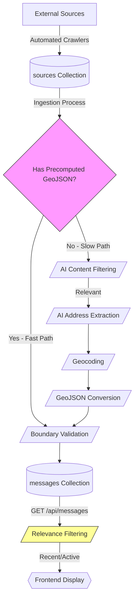
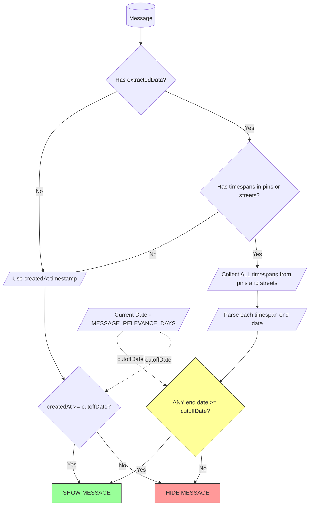

# Message Filtering and Relevance System

## Overview

The message filtering system determines which infrastructure disruption announcements appear on the map by evaluating their time relevance. Messages remain visible while their associated timespans are active, and for a configurable grace period after they end. This ensures the map shows current and recent disruptions while automatically hiding outdated information.

**Core Behavior**: A message with a water shutoff scheduled for January 15, 2026 from 08:00 to 18:00 will remain visible on the map until January 22, 2026 at 18:00 (the end time plus a 7-day default grace period).

## Message Lifecycle

Messages flow through a multi-stage pipeline from initial crawling to final display on the map:

## Processing Paths

The system handles two types of data sources based on whether they provide pre-geocoded data:

### Fast Path (Pre-geocoded Sources)

Utility companies and service providers that publish data with geographic coordinates (APIs, GIS systems) bypass AI processing entirely. These messages proceed directly from boundary validation to storage.

**Processing**: Source Data → Boundary Check → Store GeoJSON → Finalize

### Slow Path (Text-based Sources)

Municipal announcements and HTML content require natural language processing to extract locations and timespans. These messages go through AI filtering, extraction, and geocoding.

**Processing**: Source Data → Content Filtering (LLM) → Address Extraction (LLM) → Geocoding (Google + OpenStreetMap) → GeoJSON Conversion → Finalize

## Relevance Filtering Logic

The relevance filter is the primary mechanism that keeps the map current by hiding outdated messages. It operates on the frontend API and uses a dual-criteria evaluation system.

### Configuration

**Environment Variable**: `MESSAGE_RELEVANCE_DAYS`

- **Default**: 7 days
- **Purpose**: Defines how long messages remain visible after their associated events end
- **Scope**: Server-side configuration (applies to all users)

### Filtering Algorithm

The system evaluates each message using this decision tree:

### Dual-Criteria System

**Timespan-Based** (primary): Collects all timespans from pins and streets. If ANY timespan end date is within `MESSAGE_RELEVANCE_DAYS` of current date, message is visible. Format: `DD.MM.YYYY HH:MM`.

**Creation-Date** (fallback): Uses `createdAt` timestamp when no timespans exist or extraction failed. Same cutoff logic applies.

**Example**: Construction project with timespans January 5-8 and January 12-15. Created January 1, viewed January 10: visible (second timespan active). Viewed January 20: visible (last end date + 7 days = January 22). Viewed January 23: hidden (grace period expired).

## Additional Filtering

Beyond time-based relevance, several filters operate at different pipeline stages:

- **Content Relevance** (AI): Applied during message ingestion, before geocoding. Large language model analyzes text to remove announcements unrelated to infrastructure (e.g., transport schedules, events, general news). Failed messages are marked as finalized without GeoJSON.

- **Boundary Filter**: Applied twice - pre-check during source ingestion for pre-geocoded data, and post-check after geocoding for AI-extracted locations. Uses geometric intersection with defined boundary polygons to ensure geographic relevance to the target region.

- **GeoJSON Validation**: Applied at the API endpoint before returning messages to frontend. Only messages with valid, non-null GeoJSON containing at least one feature are displayed. Messages that failed geocoding are filtered out here.

- **Source Age**: Applied during source ingestion, before message processing begins. Announcements older than 90 days from publication are ignored to reduce processing load on archived content.

## Frontend Display

Messages appear as red map features (points, lines, polygons). Clicking shows details including source, dates, locations, and timespans. The message grid below the map displays a limited number of recent items.

**Visibility Requirements** (all must be true):

1. Valid GeoJSON geometry
2. Processing completed (finalized)
3. Passes relevance filtering

**Updates**: Map requires manual refresh. Crawlers run on scheduled jobs multiple times per day.

## Edge Cases

**Mixed Timespans**: Messages with multiple timespans remain visible if ANY timespan is current. The entire message shows/hides as a unit.

**Invalid Dates**: Malformed timespans are ignored; valid ones are evaluated. If all fail, falls back to `createdAt`.

**Partial Geocoding**: Successfully geocoded features display; failed addresses are omitted from map but may appear in detail text.

**Boundary Cases**: Messages at exact cutoff time are visible (uses `>=` comparison).

**Pre-geocoded Sources**: Often lack extracted timespans and use `createdAt` for filtering.

**Non-geocodable Content**: Messages without extractable locations are stored but never displayed.

## Configuration

**MESSAGE_RELEVANCE_DAYS** (default: 7)

- Controls visibility window for both timespan and creation-date filtering
- Applies server-side to all users uniformly
- Requires server restart to take effect
