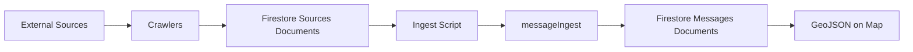

# Crawlers

Automated data collectors that fetch public notifications and disruptions from external sources, storing them as raw documents in Firestore.

## How They Work

Each crawler:

1. Fetches raw data from its source (web scraping or API)
2. Extracts structured information (title, content, dates, URLs)
3. Stores documents in Firestore with `sourceType` identifier
4. Tracks processed URLs to avoid duplicates

## Screenshot Baselines (Required)

Every crawler directory should include baseline screenshots for easier maintenance when source site design changes.

- Preferred files: `_entry.png` (listing/index page) and `_message.png` (detail page)
- Place screenshots directly in `ingest/crawlers/{source-name}/`
- Source-specific names are allowed when structure differs
- Refresh screenshots whenever selectors/parsers are updated after site redesign

Tip: full-page capture tools such as GoFullPage can speed up baseline creation.

### Crawler Architecture

Most district municipality crawlers share a WordPress-based architecture using a common set of shared WordPress crawler utilities. These utilities manage browser lifecycle, extract post links from index pages, handle deduplication, and process individual posts (fetching details, converting HTML to Markdown, parsing dates).

Crawlers that fetch from APIs (utility companies, weather services) have custom implementations tailored to each data source.

### Markdown Text Handling

Crawlers handle message formatting differently based on whether they provide precomputed GeoJSON:

**Crawlers with precomputed GeoJSON** (utility APIs, weather services):

- Skip the AI filtering and extraction pipeline
- Must store formatted text in both `message` and `markdownText` fields
- **City-wide messages**: Set `cityWide: true` with empty FeatureCollection for alerts applying to the entire city

**Crawlers without GeoJSON** (municipality websites):

- Go through the full AI extraction pipeline
- Store HTML content converted to markdown in `message` field only
- The AI filter & split stage produces `markdownText` for display

## Running Crawlers

```bash
# Run a specific crawler
npx tsx crawl --source <source-name>

# List available sources
npx tsx crawl --help
```

### Development: Cleaning Test Data

When developing a new crawler, you may want to clear test data from other sources while keeping your crawler's data:

```bash
# Delete all unprocessed sources except lozenets-sofia-bg
pnpm sources:clean --retain lozenets-sofia-bg

# Preview what would be deleted (dry-run)
pnpm sources:clean --retain lozenets-sofia-bg --dry-run
```

**Important:** Only deletes sources that have NOT been ingested into messages. Sources with corresponding messages are always preserved.

## Data Pipeline



After crawlers store raw documents in the `sources` collection, use the ingest script to process them:

```bash
# Process all sources within Oborishte boundaries
npx tsx ingest --boundaries messageIngest/boundaries/oborishte.geojson

# Process sources from a specific crawler
npx tsx ingest --source-name sofiyska-voda

# Dry run to preview
npx tsx ingest --dry-run --source-name rayon-oborishte-bg
```

The ingest script runs each source through the [messageIngest](../messageIngest) pipeline to extract addresses, geocode locations, and generate map-ready GeoJSON features.
